### Easy-Digital-Beacons-v1

A simple and easy WiFi-enabled ESP8266-powered WSPR, FT8, and FT4 beacon system
which uses NTP + DS3231 RTC for timing. Also, checkout our [cost-effective, and
robust HF 5W PA system](https://github.com/kholia/HF-PA-v5/).

It is also a WiFi-enabled VFO, which is quite useful, and convenient for radio
experimentation work.

Note: The whole project can be assembled on a breadboard (including the [250mW
amplifier](./QRPp-Amplifier)) in under 30 minutes - do give it a go ;)

The whole design is modular, parametric (cost and others), field repairable,
and super extensible. It is almost trivial to add support for more `beacon
modes`.


#### Build Steps

If you are using Windows OS, execute the following steps:

- Download this repository by [clicking here](https://github.com/kholia/Easy-Digital-Beacons-v1/archive/refs/heads/master.zip).

- Extract the downloaded zip file to a folder.

- Run the `setup_arduino_ide.bat` file inside this folder.

- Install https://github.com/me-no-dev/ESPAsyncWebServer library.

- Install https://github.com/me-no-dev/ESPAsyncTCP library.

If you are on Linux, execute the following steps:

```
sudo apt-get install git  # install 'git' if needed

git clone https://github.com/kholia/Easy-Digital-Beacons-v1.git

make install_arduino_cli
make install_platform
make deps  # using Windows?, read the 'Makefile' file

cd ~/Arduino/libraries
git clone https://github.com/me-no-dev/ESPAsyncWebServer.git
git clone https://github.com/me-no-dev/ESPAsyncTCP.git
```

Now execute these common steps:

Add your WiFi credentials in `Easy-Digital-Beacons-v4/credentials.h` file

Change the following lines in the code to use your values:

```
char message[] = "VU3CER VU3FOE MK68";
char call[] = "VU3FOE";
char loc[] = "MK68";
uint8_t dbm = 27;
```

[OPTIONAL] Change the following line in the code to suit your Si5351A module:

```
int32_t si5351CalibrationFactor =  ...
```

Use [this program](https://github.com/etherkit/Si5351Arduino/blob/master/examples/si5351_calibration/si5351_calibration.ino)
to derive the calibration value for your Si5351A module.

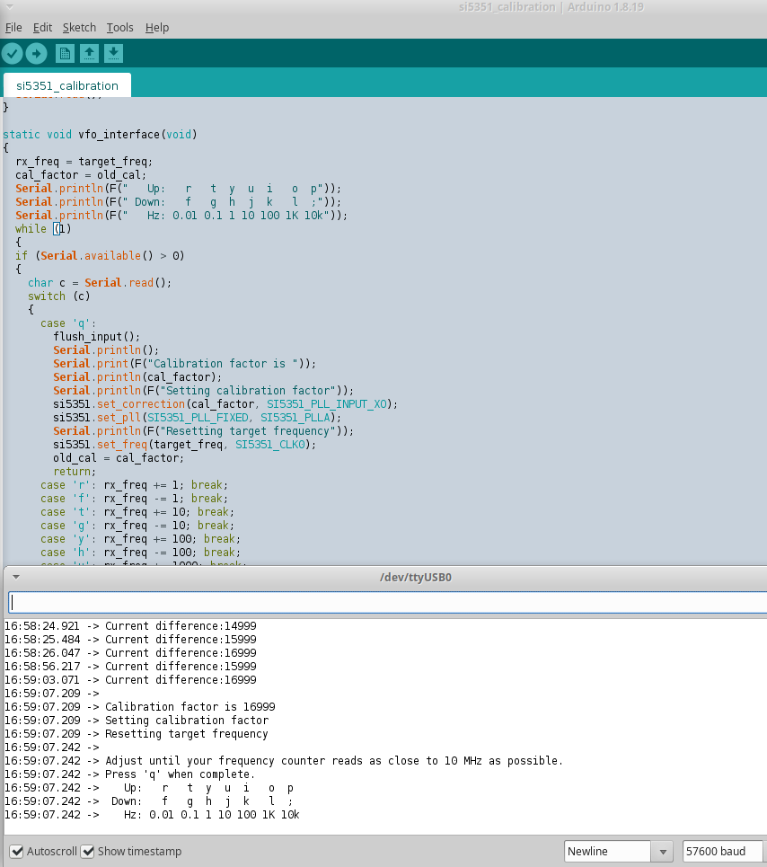

Follow [this tutorial first](https://randomnerdtutorials.com/esp8266-web-server-spiffs-nodemcu/) to
get familiar with `SPIFFS` uploading stuff. Use the `Tools -> ESP8266 Sketch
Data Upload` option in the Arduino IDE to upload the webserver resources to
ESP8266. Note: The webserver resources are located in the `data` folder
inside the `Easy-Digital-Beacons-v4` sketch.

Open and upload the `Easy-Digital-Beacons-v4` sketch to ESP8266 using the
`Sketch -> Upload` option in the Arduino IDE.

You are all set for the next step - congrats!


#### Usage

Turn off the `SW1` switch, and reboot the beacon system. The beacon system now
connects to your WiFi, and then runs a web server.

This web server can be accessed at http://beacon.local URL typically.

Beacon's web interface:

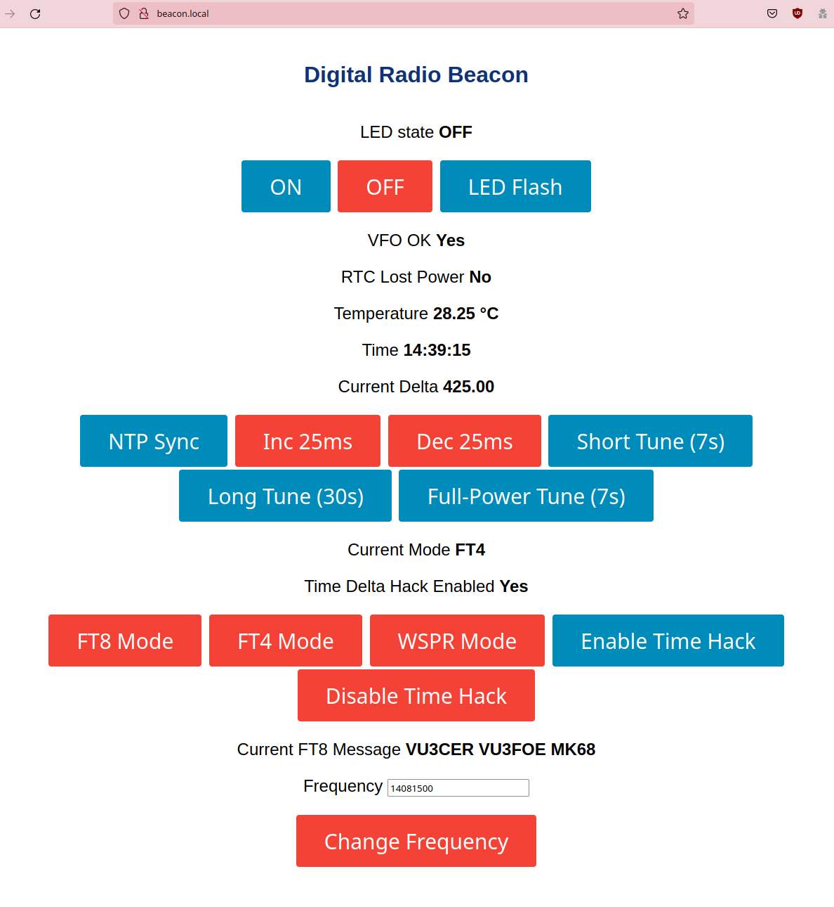

Use this web interface to configure the beacon. Please use the `NTP Sync`
option in this web interface to set the RTC time fairly correctly.

Now, turn on the `SW1` switch, and reboot the beacon system. The beacon system
is active now, and will TX as per the configuration.

TIP: Please use a local (or nearby) receiver to receive and decode the beacon
signals! This is important to ensure that your beacon is TX'ing correctly.


Si5351A module is connected via I2C to pins D1 (SCL) and D2 (SDA) of the Wemos
D1 Mini board. Connect DS3231 similarly.

Here is the schematic for the `Easy-Digital-Beacons-v4` sketch:

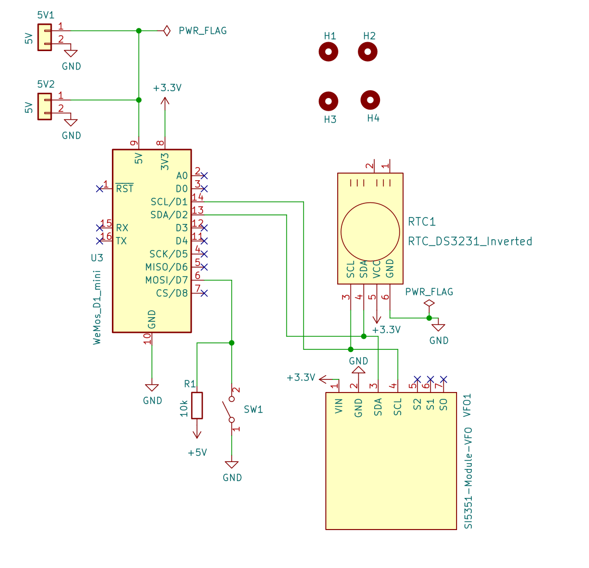

For troubleshooting, you may want to try the following similar project by the
awesome WB2CBA:

- https://antrak.org.tr/blog/esp-wspr-simple-and-inexpensive-wspr-transmitter/
- https://antrak.org.tr/blog/a-whisper-wspr-adventure-and-esp_wspr/


#### Notes

Note 2 (March-2022): The `FT4` beacon is decently reliable now (all thanks to
Anupam).

Author: Dhiru Kholia (VU3CER) - https://www.qrz.com/db/VU3CER/

Author 2: Anupam Saikia - https://github.com/anupamsaikia

The `DT` timings are very nice with `NTP Sync`, `DS3231 RTC` and the optional
`time-delta hack`.

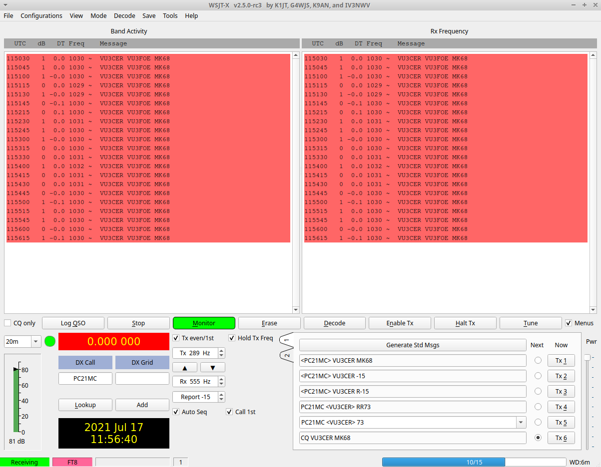

7W (or less) of HF RF power offers global communications coverage when
propagation is good:


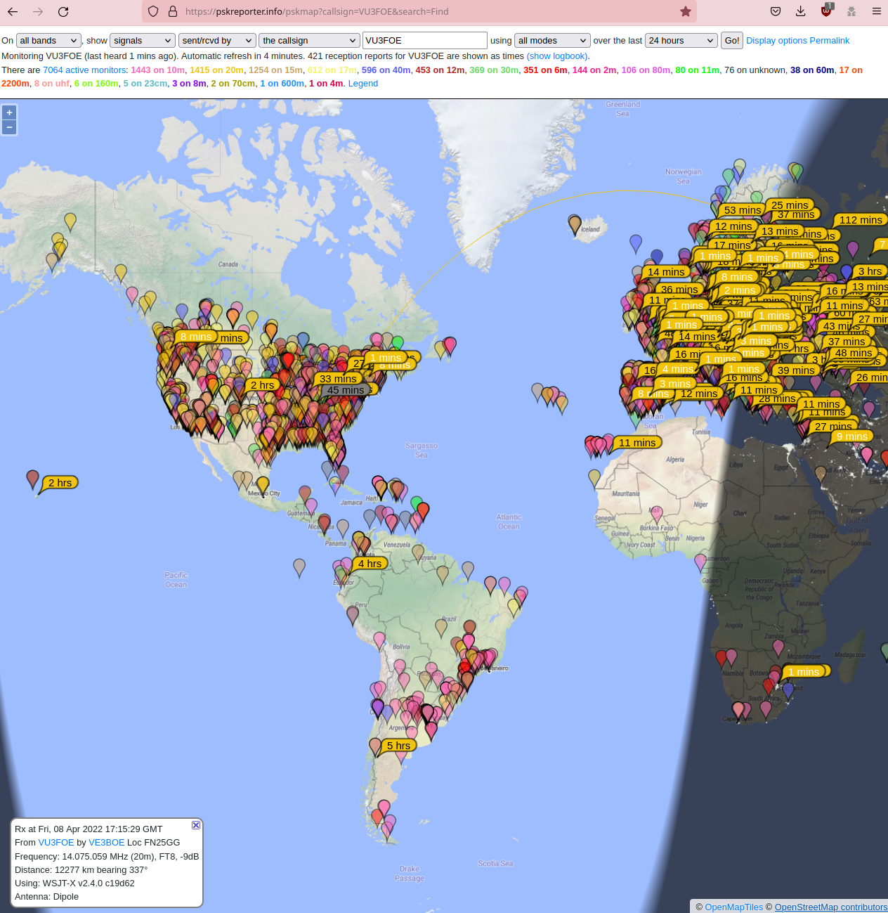

WSPR mode demo:

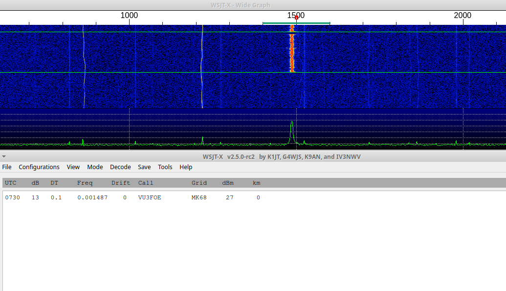

Sample 3D rendering:

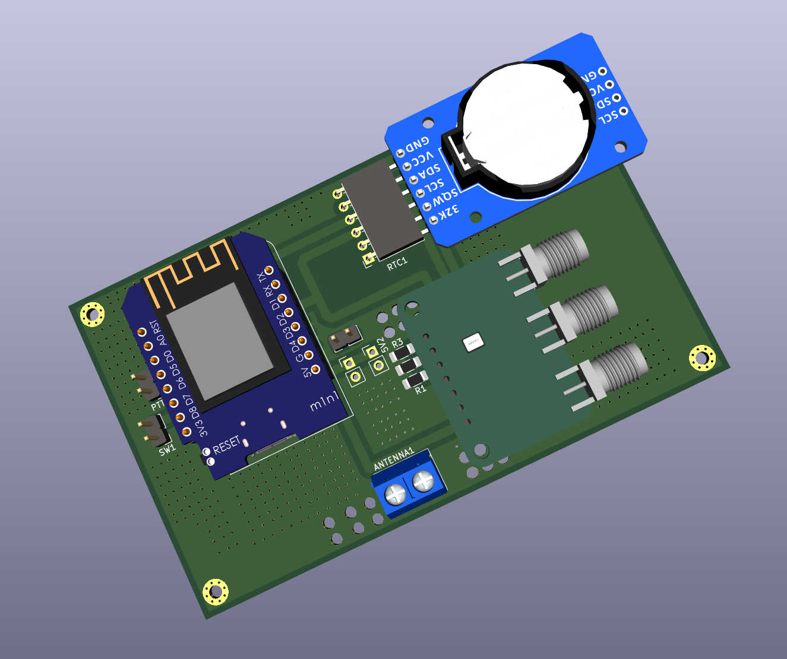

FT4 mode demo:

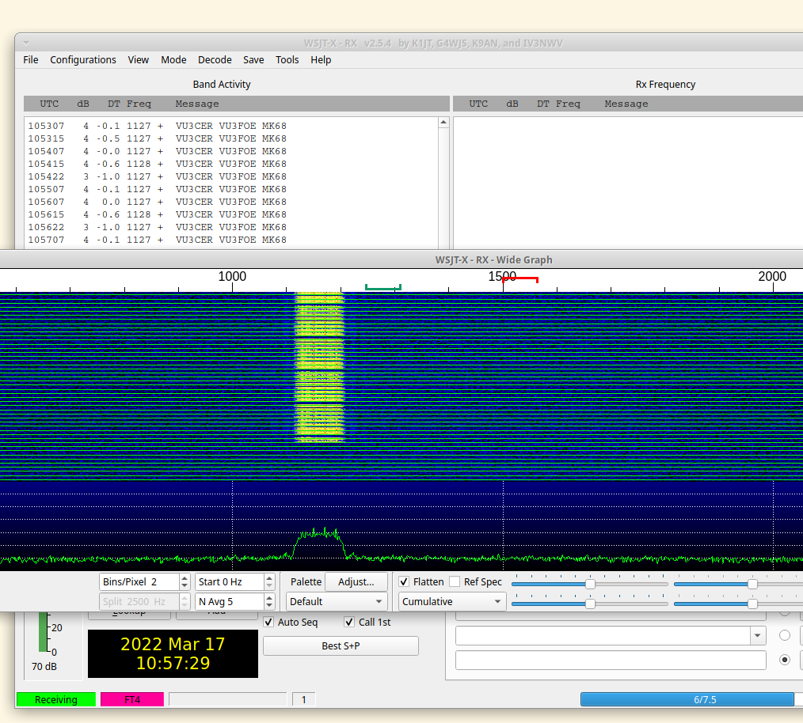

FST4W mode demo:

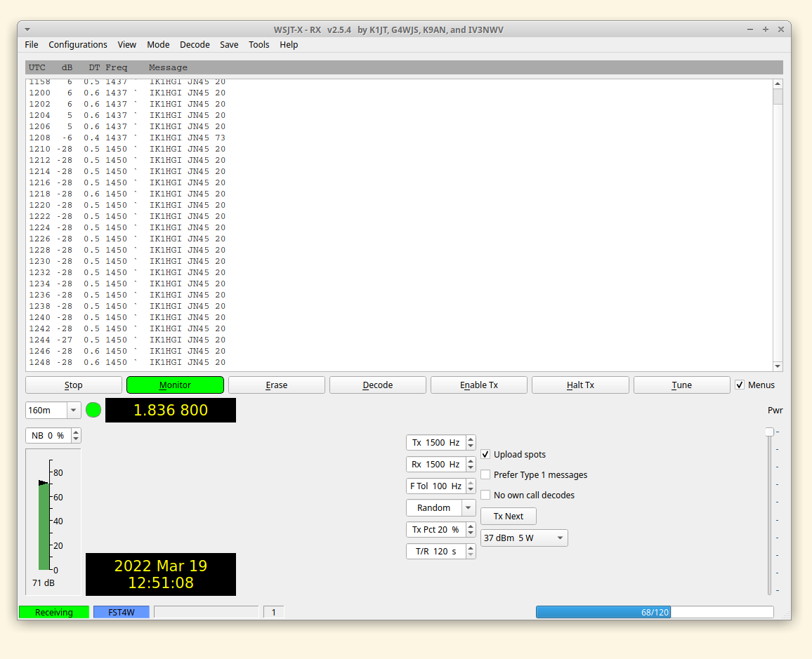


#### Battery System Recommendation

I recommend using a LiFePo4 (LFP) battery which has good energy density and is
also priced decently well.


Use the LFP battery with a `1S LFP BMS`.

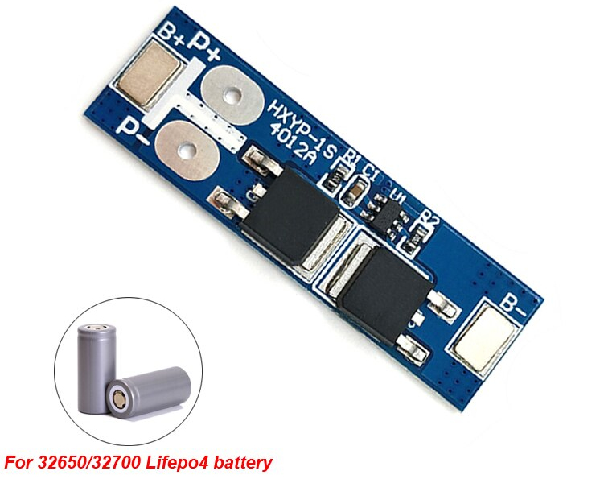

The BMS' output can be connected directly to the 3.3v input of the ESP8266
module.


#### NTP (Time) Sync for FST4W-Antonio

In the Arduino IDE, select `Tools -> Serial Monitor`. In the `Serial Monitor`
send `s` character to ESP8266 to trigger the `NTP Time Sync` process.

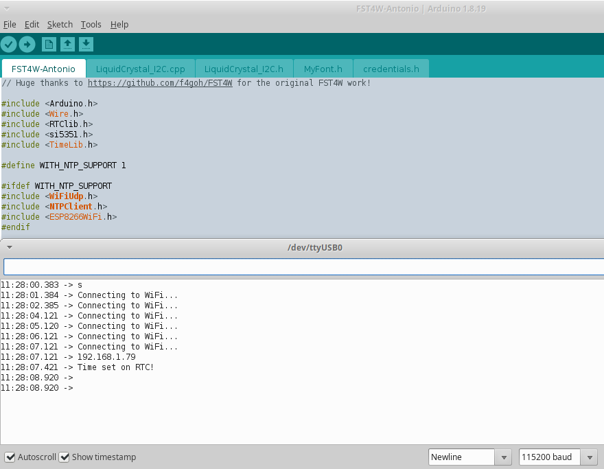

Reboot ESP8266 to check if RTC is retaining the correct time. If not, change
the RTC battery.


#### Power Notes

This will need a HF RF PA in most cases to be usable on the air.

UPDATE (May 2022): Checkout our [cost-effective, and robust HF PA system](https://github.com/kholia/HF-PA-v6/).

You can also start with the easy-to-build and breadboard-friendly [QRPp-Amplifier](./QRPp-Amplifier).


#### Relay Usage

We use a 2-channel relay as a `T/R switch`.

See https://github.com/kholia/Simple-TR-Switch for details.

Also check out https://github.com/kholia/Easy-Transceiver project.


#### BOM

- 1 x 3/5mm LED (purple or pink is recommended)

- 1 x small regular (spst) chassis mount switch

- 1 x 0.25w 470 ohm resistor (CFR / MFR)

- Relimate male connectors

- Relimate female-female cables

- Female berg strips

- Zero PCB of a suitable size

Si5351A Module:

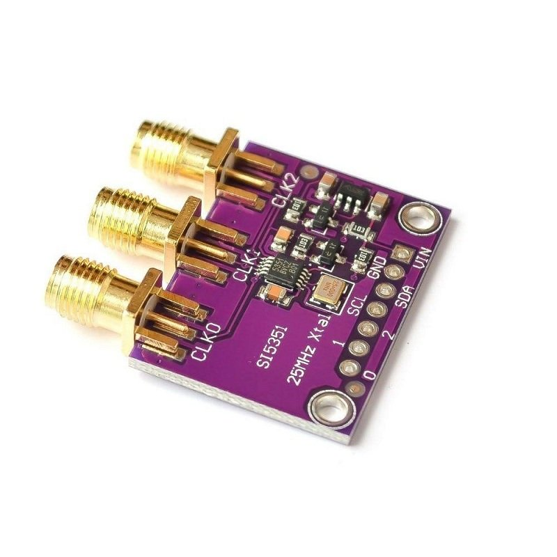

DS3231 RTC Module:


μC Board:

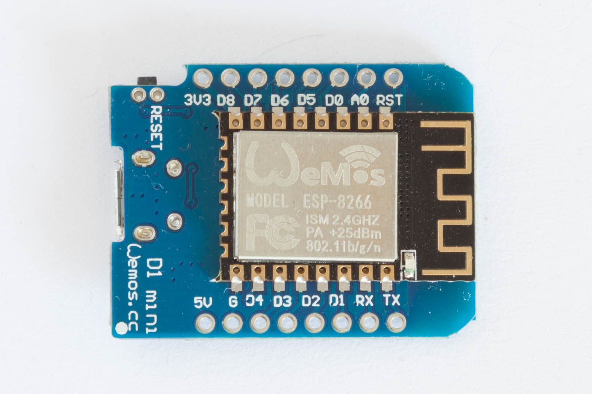

OLED screen (optional):

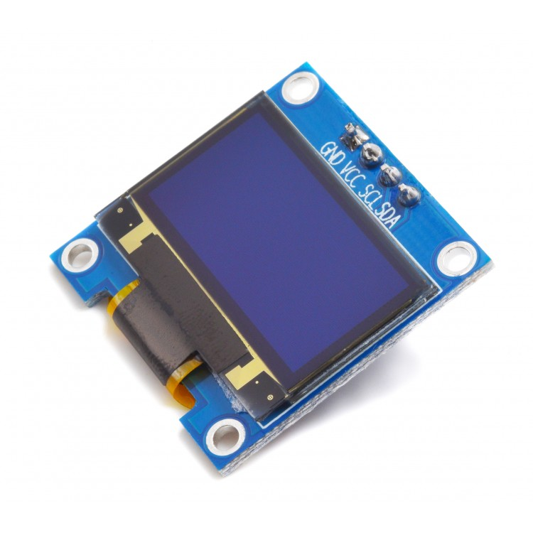


#### BOM Sources

- https://robu.in/

- https://www.electronicscomp.com/

- https://projectpoint.in/


#### Tips

Useful commands:

```
pacmd load-module module-null-sink sink_name=Virtual0
pacmd update-sink-proplist Virtual0 device.description=Virtual0
pacmd update-source-proplist Virtual0.monitor device.description=Virtual0
```

Use Gqrx and WSJT-X with a SDR device for initial frequency adjustment /
calibration. This is essential for WSPR functionality. FT8 is more
robust/tolerant of frequency deviations due to a much larger RX window.

Note: To customize the FST4W beacon to use your callsign and grid, use the
following commands to generate the `FST4Wsymbols` array data.

```
fst4sim.exe "IK1HGI JN45 20" 60 1500 0.0 0.1 1.0 10 -15 F > message.txt

message2array.exe message.txt
```

Replace the original `FST4Wsymbols` array data with the output of
`message2array.exe` program.


#### Future Tasks

- Change Si5351 calibration factor from the Web UI

- Add support for custom FT8 / FT4 messages

- Re-announce mDNS stuff [LP]

- EEPROM - save TX interval / schedule [LP]

- Reset to defaults button [LP]


#### References + Credits

- https://github.com/kholia/Si5351-Module-Clone-TCXO/ (use this module - it rocks!)

- https://github.com/kholia/Easy-Transceiver

- https://github.com/kgoba/ft8_lib

- https://github.com/etherkit/JTEncode

- https://github.com/Naguissa/uEEPROMLib

- https://randomnerdtutorials.com/esp8266-web-server-spiffs-nodemcu/

- https://lastminuteengineers.com/ds3231-rtc-arduino-tutorial/

- https://learn.adafruit.com/adafruit-si5351-clock-generator-breakout/wiring-and-test

- https://github.com/agustinmartino/wsjt_transceiver

- https://github.com/agustinmartino/wsjtx_transceiver_interface

- https://www.qrp-labs.com/synth/ms5351m.html

- https://github.com/anupamsaikia - FT4 fixes - thanks!

- https://github.com/f4goh/WSPR (pretty cool)

- https://github.com/lu7did/PixiePi

- https://github.com/iw5ejm/multibandWSPR_nodeMCU

- https://km4nmp.com/2019/08/24/vfo-for-the-pixie-wiring-and-sketch-for-ad9850/
